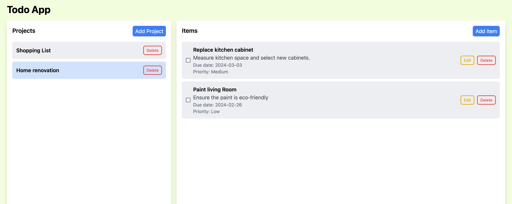

# Todo List Project

## Overview

This project is part of The Odin Project JavaScript [course](https://www.theodinproject.com/paths/full-stack-ruby-on-rails/courses/javascript).

## Concepts worked

- Organizing js source code in modules. Use of Classes.
- Separating application logic from DOM-related stuff.
- webpack for bundling.
- use of the browser's Web Storage API
- JSON manipulation
- TailwindCSS
